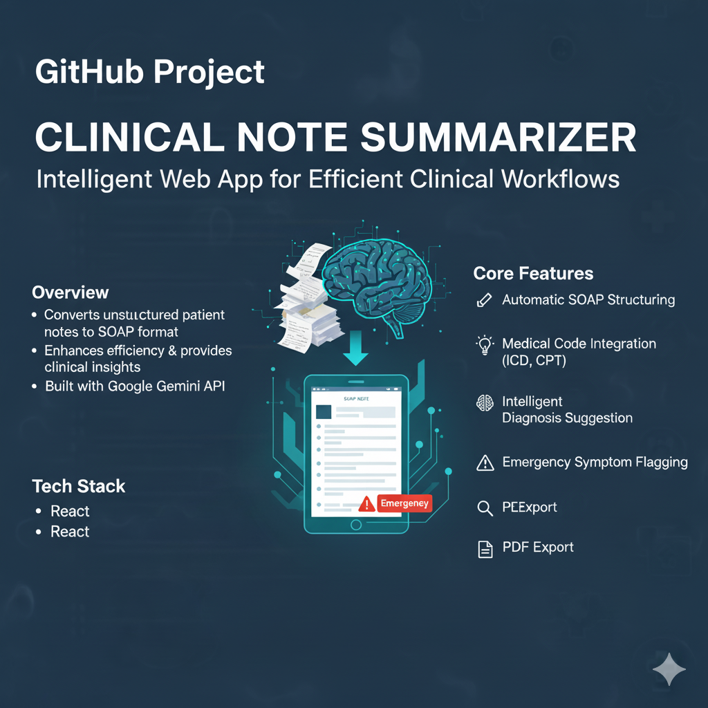

# Clinical Note Summarizer

An intelligent web application designed to automatically convert lengthy, unstructured patient notes into a structured SOAP format, significantly enhancing clinical workflow efficiency.

---

## Overview

In the fast-paced medical field, clinicians spend a significant amount of time documenting patient encounters. The Clinical Note Summarizer is a powerful tool built with the Google Gemini API that addresses this challenge head-on. It takes raw, transcribed, or handwritten clinical notes and instantly transforms them into a standardized, easy-to-read SOAP (Subjective, Objective, Assessment, Plan) format.

Beyond simple structuring, the app provides deep clinical insights by extracting critical information, flagging potential emergencies, and identifying nuanced linguistic cues within the text, allowing medical professionals to focus more on patient care and less on administrative overhead.

## Core Features

-   **Automatic SOAP Structuring**: Extracts and organizes patient information into the four key sections:
    -   **S**ubjective: The patient's self-reported symptoms and history.
    -   **O**bjective: Measurable findings from exams and tests.
    -   **A**ssessment: The clinician's diagnosis or differential diagnoses.
    -   **P**lan: The proposed treatment and follow-up plan.

-   **Medical Code Integration**: Auto-detects and extracts relevant medical codes from the note's context:
    -   **ICD Codes**: International Classification of Diseases codes for diagnoses.
    -   **CPT Codes**: Current Procedural Terminology codes for procedures.

-   **Intelligent Diagnosis Suggestion**: Provides a preliminary diagnosis based on the reported symptoms, leveraging the model's medical reasoning capabilities.

-   **Emergency Symptom Flagging**: Acts as a safety net by continuously evaluating the text for high-risk symptoms (e.g., chest pain, shortness of breath, severe bleeding). If detected, it displays a prominent "⚠️ Emergency" warning with the specific reason.

-   **Advanced NLP Insights**: Goes beyond keywords to analyze the clinical narrative for deeper context:
    -   **Sentiment Analysis**: Identifies expressions of patient feeling, such as anxiety or pain levels.
    -   **Negation Detection**: Recognizes explicit denials of symptoms (e.g., "patient denies fever").
    -   **Temporal Information**: Extracts phrases related to the timing and duration of symptoms (e.g., "started 3 days ago").

-   **PDF Export**: Allows users to generate and download a clean, professional PDF of the complete structured summary with a single click, perfect for archiving or sharing.

## How to Use

1.  **Input Note**: Paste or type the unstructured clinical note into the text area on the left.
2.  **Summarize**: Click the "Summarize Note" button.
3.  **Review Output**: The structured summary, codes, insights, and any emergency flags will appear on the right side of the screen.
4.  **Export**: If needed, click the "Export as PDF" button to download a copy of the summary.

## Tech Stack

-   **Frontend**: React, TypeScript, Tailwind CSS
-   **AI Engine**: Google Gemini API (`gemini-2.5-pro`) for state-of-the-art natural language understanding and generation.
-   **PDF Generation**: `jspdf` and `html2canvas` for client-side document creation.
